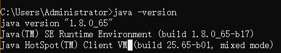

[TOC]

## 一、JDK环境变量配置

1. 控制台输入java -version没有配置的话就不会显示JDK版本

2. 下载相应的JDK版本，进行环境变量配置，jdk免安装版本和安装版本的不同之处。

​	安装：

​	免安装

​	环境变量配置：系统变量中新加JAVA_HOME，值设为JDK目录。

​							 修改Path变量添加%JAVA_HOME%\bin,即可。

​	 配置成功截图：

## 二、控制台命令行编译执行java程序

	1. javac来编译该程序.java
 	2. java来执行该文件

## 三、创建JAVA项目

## 四、一些常用的eclipse快捷键

	1. main + alt + /自动写好main方法
 	2. syso+ alt + / 自动补齐控制台输出
 	3. for + alt + /快速输入for循环
 	4. 快速生成getter,setter方法等		

