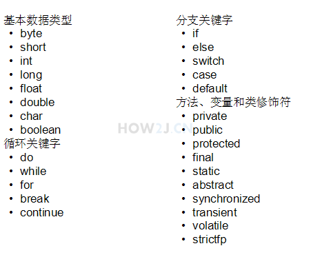
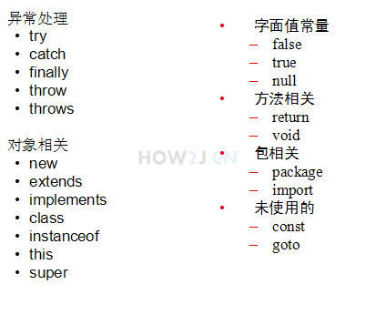

[TOC]

## 变量

### 1. 基本数据类型有：

		* 整形byte short int long(L)
		* 浮点float(f),double
		* 布尔boolean(false,true)
		* 字符char

### 2.String类型

​	-  `String str = ``"Hello Java"``;` 

### 3.基本数据类型赋值为字面值赋值

  * 给基本类型的变量赋值的方式叫做 **字面值**，不用 **new**

  * ```java
        int hexVal = 0x1a; //16进制
        int oxVal = 032; //8进制
        int binVal = 0b11010; //2进制
    ```

*  整型和整型进行运算的时候，如果两边的值都是小于或者等于int的，那么其结果就是int 

### 4.命令规范关键字列表

​	* 

​	* 

### 5、final修饰符

	* 可以修饰变量，类，方法，只能进行一次赋值

