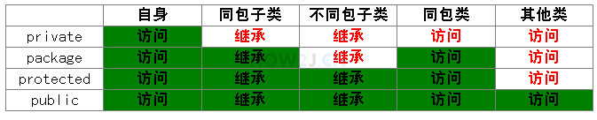

[TOC]

## 类和对象

### 1、引用和对象，

​	前面的对象叫做引用，后面才是new的一个对象，一个引用只能指向一个对象，而一个对象可以被多个引用指向

### 2、继承

​	extends

### 3、重载

​	方法名相同，参数不同，可变数量的参数`hero...heros,`估计是类型...参数

### 4、构造方法

​	实例化对象的方法，默认无参为隐式的构造方法，可以进行重载，没有返回类型。

### 5、this关键字表示当前对象

​	使用this调用其它的构造方法this()

### 6、传参

​		基本类型传参为值传递，引用类型传参为该对象传参，该参数也是一个引用，可以改变该值。

### 7、包

​		package 包名，相同的类放在相同的包中。

​		引入其它的类，必须引入相应的包中的类。import

### 8、访问修饰符

private私有的， 没有修饰符即代表package/friendly/default  ， 受保护的修饰符protected ，公共的public



### 9、类属性，静态属性

​		static 类型 变量名，类名.属性名   对象名.属性名  所有对象共享

### 10、类方法

​		public static void 方法名，不能调用动态的东西，调用同上。

### 11、属性初始化

		* 对象属性初始化：声明时初始化，构造函数初始化，初始化块
		* 类属性初始化：声明时初始化，初始化静态块

### 12、单例模式

一个类只有一个对象存在的情形。

 * 饿汉式：

   ```java
   private Hero(){
   }
   private Hero hero = new Hero()
   public static Hero getInstance(){
       return hero;
   }
   ```

   

 * 懒汉式：

   ```java
   private Hero(){
   }
   private Hero hero;
   public static Hero getInstance(){
       if(hero==NULL){
           hero = new Hero();
       }
       return hero;
   }
   ```

   

 * 单例模式三要素：

   	* 私有化构造函数
      	* 静态属性指向实例对象
      	* 静态方法或者类方法构造或者返回该实例

​	

### 13、枚举

​		枚举也是一个类，定义常量，与switch结合在一起。

​        `定义枚举 public enum yangyutian{youxiu,youxiu2}`

​		`增强型for遍历枚举 for i ：yangyutian.values()`