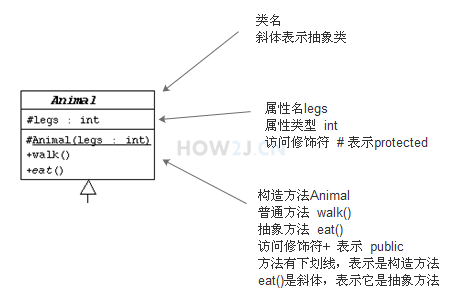
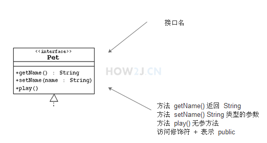

[TOC] 

##  接口与继承

### 1、接口

​		interface 声明接口  implements 继承接口 必须实现该方法

### 2、对象转型

​		引用类型与对象类型，引用类型指向的对象可以变，而创建的对象类型是一直不会变的。就是有继承关系可以转变

向下转有风险，不同不行。

### 3、重写、重载、覆盖（子类覆盖父类的对象方法）

### 4、多态

		* 运算符多态
		* 父类和接口多态，父类（接口）指向不同的子类型

### 5、隐藏（子类重写父类的类方法）

### 6、super关键字

​	子类构造方法会默认调用父类无参构造方法，当没有时会报错，可以使用super(参数)进行调用

### 7、Object类是所有类的父类

​		默认方法有：toString返回String、finalize() void 垃圾回收、equals()内容相同、==指向对象相同、

### 8、final关键字

* 修饰类，public final class String 不能被继承
* 修饰方法，不能被重载
* 修饰属性，只能被赋值一次
* 修饰引用，只能指向一个对象一次

### 9、抽象类abstract

* 一个类中的方法被声明为abstract后，该类必须为抽象类
* 是空方法没有实现体
* 抽象类不能被直接实例化
* 子类必须提供实现方法
* 可以直接声明为抽象类没有抽象方法
* 与接口的区别
  1. 接口可以多继承，而抽象类只能单继承
  2. 抽象类可以正常定义访问修饰符，final和static 而 接口只能是public static final显示和默认为这样

### 10、接口默认方法

* 本来接口都是抽象方法（默认），但是现在接口可以添加默认方法defalut类型，子类可以不实现，除非有冲突。

### 11、内部类

* 静态内部类：必须通过外部类对象进行实现，内部类可以访问外部类的private属性。（与属性方法平等的位置）
* 非静态内部类：静态类只能是静态内部类，只能访问外部静态属性，不需要实例化，外部对象直接访问。（与属性方法平等的位置）
* 匿名类：声明一个类的同时实现它，当场实现抽象方法，实例化接口和抽象类。（ 还可以是主方法，for循环里等等地方 ）
* 本地类：可以是主方法，for循环之中，且有名字（ 还可以是主方法，for循环里等等地方 ）必须final修饰，否则会自动加上。

### 12、统一建模语言UML

* 类图：

* 接口图：
  * 

* 实线箭头表示继承的关系，虚线表示实现了这个接口

