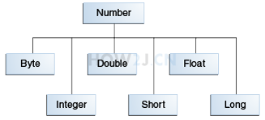
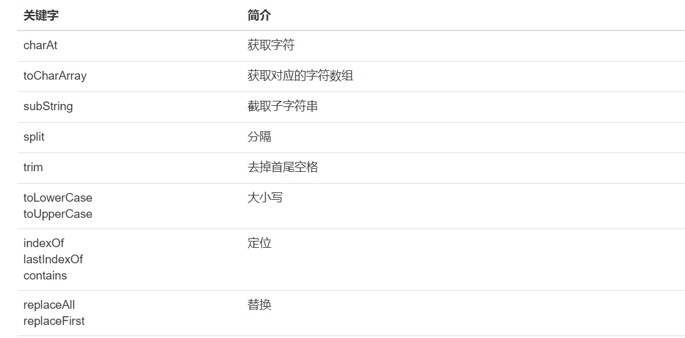

[TOC]

## 数字与字符串

### 1、装箱和拆箱

* 如图：

* 基本数据类型都有对应的类类型，他们可一自动实现类型转化，叫做拆箱和装箱，也可以通过构造方法和调用方法来实现` Integer i = new Integer(int a) i.intValue()他们都有对用的最大最小值为 对应的类类型.MAX_VALUE,MIN_VAULE`

  

### 2、字符串转化

* 数字转化成字符串
  * 装箱，调用`toString`方法
  * 使用`String.valueOf()`方法
* 字符串转化成数字
  * 转化为整数：`Integer.parseInt   或者 parseFloat`

### 3、数学方法

```java
Math.round() //四舍五入整数
Math.random() //产生0-1的随机数，没有1
Math.PI  Math.E
Math.sqrt() //次方    
Math.pow(a,b)  //a的b次方
```

### 4、格式化输出

* `System.out.printf和format函数`%s是字符串，%n换行，%d是数字,然后就是可以控制整数输出格式%+-1.8d

### 5、字符

```java
//封装类为Character
str.toCharArray()//将字符串转化为字符数组
char a;
        System.out.println(Character.isLetter('a'));//判断是否为字母
        System.out.println(Character.isDigit('a')); //判断是否为数字
        System.out.println(Character.isWhitespace(' ')); //是否是空白
        System.out.println(Character.isUpperCase('a')); //是否是大写
        System.out.println(Character.isLowerCase('a')); //是否是小写 
        System.out.println(Character.toUpperCase('a')); //转换为大写
        System.out.println(Character.toLowerCase('A')); //转换为小写
        String a = 'a'; //不能够直接把一个字符转换成字符串
        String a2 = Character.toString('a'); //转换为字符串
```

### 6、字符串

* 创建字符串：字面值默认创建，new一个（其实是创建两个)，“+”产生` char[] cs = new char[]{'崔','斯','特'};`还可以通过new字符数组创建一个对象。

* 还可以这样格式化输出

  * ```java
            String sentenceFormat ="%s 在进行了连续 %d 次击杀后，获得了 %s 的称号%n";
            String sentence2 = String.format(sentenceFormat, name,kill,title);
            System.out.println(sentence2);
    ```

* 字符串长度：`length()方法返回当前字符串的长度`

### 7、操作字符串



`字符串数组：char a[] = new char[]{1,2,3};char a[]= new char[5];str.toArrayChar();字符串数组：String a[]`

### 8、比较字符串

* 对象相同==，equals内容相同，equalsIgnoreCase(),startsWith,endWith

### 9、SringBuffer可变长的字符串

* append追加 
  delete 删除 
  insert 插入 
  reverse 反转
* 长度length(),容量capacity()